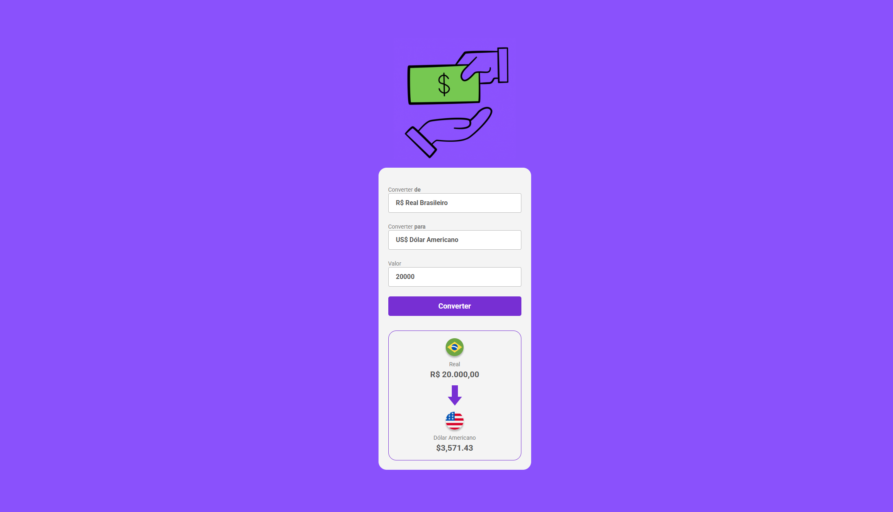

# 📲 DevClub Convert Money

Conversor de moedas desenvolvido durante os estudos no **DevClub**, com base em HTML, CSS e JavaScript.  
Permite converter de **Real Brasileiro (BRL)** para diversas moedas internacionais em tempo real, com uma interface simples e responsiva.

---

## 💻 Demonstração

<div align="center">
  
</div>

---

## 🚀 Funcionalidades

- Conversão de:
  - 💵 Real para Dólar Americano
  - 💶 Euro
  - ₿ Bitcoin
  - 💷 Libra Esterlina
- Interface animada e intuitiva
- Layout responsivo
- Design moderno com cores contrastantes
- Atualização dinâmica do valor convertido

---

## 🛠️ Tecnologias utilizadas

- HTML5
- CSS3
- JavaScript (puro)
- `Intl.NumberFormat` para formatação de moeda
- Imagens vetoriais e ícones personalizados

---

## 📁 Estrutura de pastas

📦 conversor-de-moedas-git

├── index.html

├── style.css

├── scripts.js

└── img/

├── logo-money.gif

├── moeda-real.png

├── dolar.png

├── euro.png

├── libra.png

├── bitcoin.png

└── arrow.png

---

## ✅ Como rodar o projeto

1. Clone o repositório:

```bash
git clone https://github.com/alvarodev12/conversor-de-moedas-git.git

cd conversor-de-moedas-git

📸 Layout em destaque
💻 Desktop:


🙌 Créditos
Projeto desenvolvido com base nas aulas do DevClub, com orientação de Rodolfo Mori.
Desenvolvedor: Álvaro Souza


---
```
